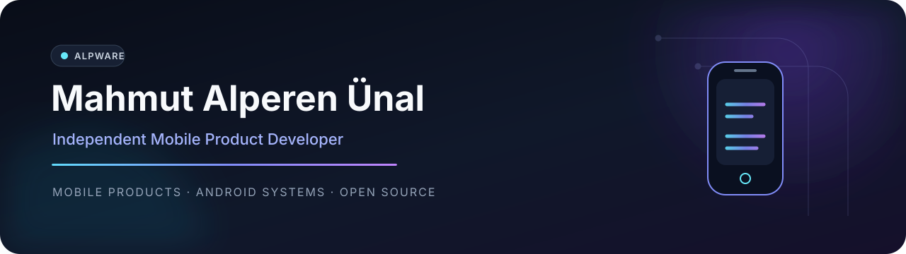

  

   

  <a href="https://mahmutalperenunal.com"><strong>Website</strong></a>
  &nbsp;·&nbsp;
  <a href="https://www.alpwarestudio.com"><strong>AlpWare Studio</strong></a>
  &nbsp;·&nbsp;
  <a href="https://play.google.com/store/apps/dev?id=5245599652065968716"><strong>Google Play</strong></a>
  &nbsp;·&nbsp;
  <a href="https://www.linkedin.com/in/mahmut-alperen-unal/"><strong>LinkedIn</strong></a>

 

I design, build, publish, and maintain mobile products from the first idea through long-term release support. My work centers on modern Android development, privacy-conscious product design, offline-first experiences, and thoughtful platform integration.

<table>
  <tr>
    <td width="33%" valign="top">
      <strong>Mobile products</strong>  
      Production applications built with Kotlin, Jetpack Compose, and Flutter.
    </td>
    <td width="33%" valign="top">
      <strong>Android systems</strong>  
      Utilities that work carefully with platform services, permissions, and device behavior.
    </td>
    <td width="33%" valign="top">
      <strong>Open development</strong>  
      Source code, engineering decisions, documentation, and community-ready projects.
    </td>
  </tr>
</table>

## Selected work

<table>
  <tr>
    <td width="50%" valign="top">
      
        
      An offline-first encrypted vault for passwords, private records, attachments, backups, and secure everyday access.
        
      <a href="https://play.google.com/store/apps/details?id=com.mahmutalperenunal.passwordsbook"><strong>Google Play →</strong></a>
    </td>
    <td width="50%" valign="top">
      
        
      A rootless Android utility that adapts display refresh rate to real interaction while respecting device-specific behavior.
        
      <a href="https://github.com/mahmutaunal/Adaptive-Hz"><strong>Source code →</strong></a>
    </td>
  </tr>
  <tr>
    <td width="50%" valign="top">
      
        
      A privacy-respecting internet radio app with background audio, widgets, Android Auto, CarPlay, and shared playback state.
        
      <a href="https://github.com/mahmutaunal/Frekio"><strong>Source code →</strong></a>
    </td>
    <td width="50%" valign="top">
      
        
      A modern QR and barcode toolkit for scanning, creation, customization, organization, and secure offline use.
        
      <a href="https://play.google.com/store/apps/details?id=com.mahmutalperenunal.kodex"><strong>Google Play →</strong></a>
    </td>
  </tr>
</table>

## Product collection

| Product | Built for | Availability |
| --- | --- | --- |
| **Score Book** | Offline scorekeeping, game history, player statistics, and local backup | [Google Play](https://play.google.com/store/apps/details?id=com.mahmutalperenunal.skordefteri) |
| **WiSense** | On-device Wi-Fi channel analysis and router recommendations | [Google Play](https://play.google.com/store/apps/details?id=com.mahmutalperenunal.channelsense) · [Source](https://github.com/mahmutaunal/ChannelSense) |
| **Wakeon** | Cross-platform Wake-on-LAN device management | [Google Play](https://play.google.com/store/apps/details?id=com.alpwarestudio.wakeon) · [Source](https://github.com/mahmutaunal/Wakeon) |
| **KeymapKit** | System-level physical keyboard layouts for Android, without a custom IME | [Google Play](https://play.google.com/store/apps/details?id=com.alpware.keymapkit) · [Source](https://github.com/mahmutaunal/KeymapKit) |

## Open-source systems

<table>
  <tr>
    <td width="50%" valign="top">
      <strong><a href="https://github.com/mahmutaunal/DarkSwitch">ShadeOn</a></strong>
        
      Rootless, per-app system dark-mode attempts using Shizuku and foreground-app detection.
        
      <code>Kotlin</code> <code>Compose</code> <code>Shizuku</code>
    </td>
    <td width="50%" valign="top">
      <strong><a href="https://github.com/mahmutaunal/NotifyBridge">Novi</a></strong>
        
      Encrypted notification forwarding between Android and macOS over the local network.
        
      <code>Kotlin</code> <code>Compose</code> <code>SwiftUI</code>
    </td>
  </tr>
</table>

## How I build

> **Privacy-first** — collect less, keep sensitive work on-device, and explain network behavior clearly.

> **Offline-first** — keep core experiences useful without requiring a permanent connection.

> **Platform-aware** — use native capabilities when they create a more reliable and coherent product.

> **Long-term** — treat publishing as the beginning of maintenance, not the end of development.

## Working stack

`Kotlin` &nbsp; `Jetpack Compose` &nbsp; `Flutter` &nbsp; `Dart` &nbsp; `SwiftUI`  
`Coroutines` &nbsp; `Flow` &nbsp; `Room` &nbsp; `WorkManager` &nbsp; `Shizuku`  
`Android Keystore` &nbsp; `Biometrics` &nbsp; `Play Integrity` &nbsp; `Firebase`

## AlpWare Studio

[AlpWare Studio](https://www.alpwarestudio.com) is the independent product studio behind my published applications and open-source work. It focuses on useful, understandable software built with respect for privacy, platform conventions, and long-term maintainability.

 

  <a href="https://github.com/mahmutaunal?tab=repositories"><strong>Explore repositories</strong></a>
  &nbsp;·&nbsp;
  <a href="https://play.google.com/store/apps/dev?id=5245599652065968716"><strong>View published apps</strong></a>

