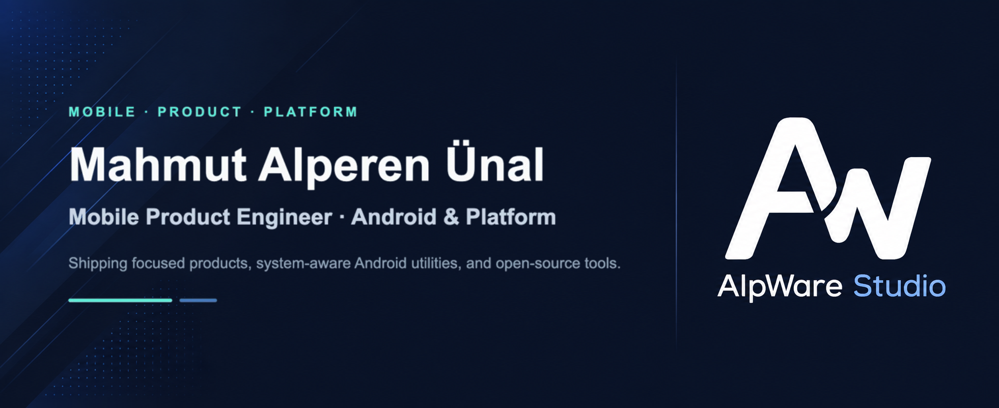
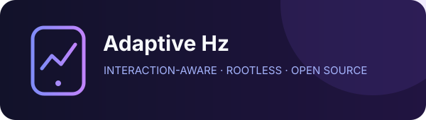

  

   

  <a href="https://mahmutalperenunal.com"><strong>Website</strong></a>
  &nbsp;·&nbsp;
  <a href="https://www.alpwarestudio.com"><strong>AlpWare Studio</strong></a>
  &nbsp;·&nbsp;
  <a href="https://play.google.com/store/apps/dev?id=5245599652065968716"><strong>Google Play</strong></a>
  &nbsp;·&nbsp;
  <a href="https://www.linkedin.com/in/mahmut-alperen-unal/"><strong>LinkedIn</strong></a>

 

I build and ship mobile products with a strong focus on **Android**, **privacy-conscious architecture**, **offline-first experiences**, and **platform-level tooling** — from product idea and interface to release and long-term maintenance.

My work sits between product engineering and the Android platform: polished end-user apps on one side, system-aware utilities and open-source experiments on the other.

<table>
  <tr>
    <td width="33%" valign="top">
      <strong>Mobile products</strong>  
      Production applications built with Kotlin, Jetpack Compose, and Flutter.
    </td>
    <td width="33%" valign="top">
      <strong>Android systems</strong>  
      Utilities that work carefully with platform services, permissions, and device behavior.
    </td>
    <td width="33%" valign="top">
      <strong>Open development</strong>  
      Source code, engineering decisions, documentation, and community-ready projects.
    </td>
  </tr>
</table>

## Featured work

<table>
  <tr>
    <td width="50%" valign="top">
      
        
      A rootless Android utility that adapts display refresh rate to real interaction while respecting device-specific behavior.
        
      <a href="https://github.com/mahmutaunal/Adaptive-Hz"><strong>Source code →</strong></a>
    </td>
    <td width="50%" valign="top">
      
        
      An offline-first encrypted vault for passwords, private records, attachments, backups, and secure everyday access.
        
      <a href="https://play.google.com/store/apps/details?id=com.mahmutalperenunal.passwordsbook"><strong>Google Play →</strong></a>
    </td>
  </tr>
  <tr>
    <td width="50%" valign="top">
      
        
      A privacy-respecting internet radio app with background audio, widgets, Android Auto, CarPlay, and shared playback state.
        
      <a href="https://github.com/mahmutaunal/Frekio"><strong>Source code →</strong></a>
    </td>
    <td width="50%" valign="top">
      
        
      A modern QR and barcode toolkit for scanning, creation, customization, organization, and secure offline use.
        
      <a href="https://play.google.com/store/apps/details?id=com.mahmutalperenunal.kodex"><strong>Google Play →</strong></a>
    </td>
  </tr>
  <tr>
    <td width="50%" valign="top">
      
        
      System-level physical keyboard layouts for Android, integrated through the platform layout provider instead of a custom IME.
        
      <a href="https://play.google.com/store/apps/details?id=com.alpware.keymapkit"><strong>Google Play →</strong></a>
    </td>
    <td width="50%" valign="top">
      
        
      On-device Wi-Fi analysis that evaluates interference, channel width, overlap, signal strength, and confidence to recommend better channels.
        
      <a href="https://play.google.com/store/apps/details?id=com.mahmutalperenunal.channelsense"><strong>Google Play →</strong></a>
    </td>
  </tr>
</table>

## More work

| Project | Built for | Availability |
| --- | --- | --- |
| **Wakeon** | Cross-platform Wake-on-LAN device management | [Google Play](https://play.google.com/store/apps/details?id=com.alpwarestudio.wakeon) · [Source](https://github.com/mahmutaunal/Wakeon) |
| **DarkSwitch** | Rootless per-app Force Dark experiments powered by Shizuku, foreground detection, strategy fallback, and an offline compatibility database | [Source](https://github.com/mahmutaunal/DarkSwitch) |
| **LeadMailFinder** | Open-source company discovery, email extraction, and outreach tooling for job seekers and B2B prospecting | [Source](https://github.com/mahmutaunal/leadmail-finder) |
| **Score Book** | Offline scorekeeping, game history, player statistics, and local backup | [Google Play](https://play.google.com/store/apps/details?id=com.mahmutalperenunal.skordefteri) |
| **Play Store Launcher** | A deliberately tiny Android TV utility that exposes and launches the hidden Google Play Store without unnecessary permissions or background work | [Source](https://github.com/mahmutaunal/Play-Store-Launcher) |
| **Zapret macOS Discord** | A focused one-command Zapret setup for Discord on Apple Silicon Macs, covering installation, configuration, and networking behavior | [Source](https://github.com/mahmutaunal/zapret-macos-discord) |

## How I build

> **Privacy-first** — collect less, keep sensitive work on-device, and explain network behavior clearly.

> **Offline-first** — keep core experiences useful without requiring a permanent connection.

> **Platform-aware** — use native capabilities when they create a more reliable and coherent product.

> **Long-term** — treat publishing as the beginning of maintenance, not the end of development.

## Working stack

`Kotlin` &nbsp; `Jetpack Compose` &nbsp; `Coroutines` &nbsp; `Flow` &nbsp; `Room` &nbsp; `WorkManager`  
`Shizuku` &nbsp; `Android System APIs` &nbsp; `Android Keystore` &nbsp; `Biometrics` &nbsp; `Play Integrity`  
`Flutter` &nbsp; `Dart` &nbsp; `SwiftUI` &nbsp; `Firebase` &nbsp; `Networking` &nbsp; `Shell`

## AlpWare Studio

I build and publish my independent products under **[AlpWare Studio](https://www.alpwarestudio.com)** — focused on useful, understandable software shaped by privacy, simplicity, platform conventions, and long-term maintainability.

 

  <a href="https://github.com/mahmutaunal?tab=repositories"><strong>Explore repositories</strong></a>
  &nbsp;·&nbsp;
  <a href="https://play.google.com/store/apps/dev?id=5245599652065968716"><strong>View published apps</strong></a>

